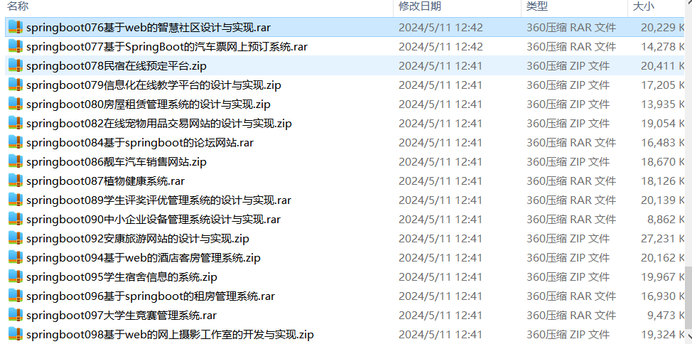

# springboot_teach_lib_competition_cinema_shop
### **项目介绍**

🏫 **教师工作量管理系统** —— 课程安排、教师工作量统计、考核评估，助力高校教学管理智能化 📊📚

📖 **图书馆管理系统** —— 图书借阅、预约管理、读者统计，实现高效便捷的图书馆信息化管理 📚🔍

🏆 **学科竞赛管理系统** —— 竞赛报名、评审管理、成绩查询，支持各类学科竞赛的智能化运作 🏅🎓

🎬 **影城管理系统** —— 影院排片、在线购票、会员管理，提升电影票务的数字化体验 🍿🎟️

🛍️ **在线商城系统** —— 商品管理、购物车、订单支付、物流跟踪，打造完整的电商交易平台 🛒💳

本仓库采用 **SpringBoot** 作为核心后端，结合 **Spring Security、Redis、MySQL、MyBatis Plus、Vue.js** 等技术，提供高效、稳定的企业级 Web 应用解决方案。欢迎 **Star ⭐、Fork 🍴**，一起学习进步！ 🚀💡

项目部署说明✨：

推荐使用：谷歌浏览器

后台地址😎
http://localhost:8080/springboot/admin/dist/index.html

管理员  abo 密码 abo

前台地址😎

http://localhost:8080/springboot/front/index.html

在src\main\resources\application.yml中编辑数据库配置🎉										
url: jdbc:mysql://127.0.0.1:3306/springboot?useUnicode=true&characterEncoding=utf-8&useJDBCCompliantTimezoneShift=true&useLegacyDatetimeCode=false&serverTimezone=UTC
username: root
password: 123456

文档预览👀

其他项目合集✨

